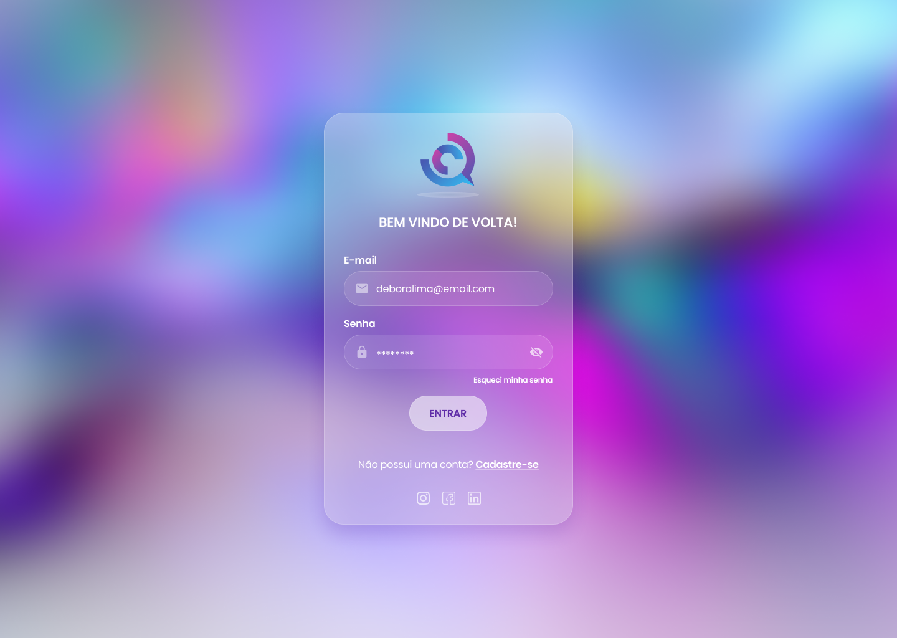

<h1 align="center">Glassmorphism login project</h1>

<h2 align="center">About 📖</h2>
   
   <p align="center">
      This solution was developed as a study for the effect of glasmorphia based on the design kindly offered by a colleague
   </p>

- ✅ "Desktop development"
- 🔄 "Mobile development"

---

<h2 align="center">Preview 💻📱</h2>

   <p align="center">
      
   </p>

---

<h2 align="center">Layout 🎨</h2>

   <p align="center">
      The Layout was developed by <a href="https://www.linkedin.com/in/deborachristolima/">Débora Lima</a> and you can access it on Figma:
      
   - <a href="https://www.figma.com/file/zh66537oXLPTogjIVpYcVU/Glassmorphism?node-id=0%3A1">Desktop design</a> 🖥️
   
   </p>

---

<h2 align="center">Technologies 🚀</h2>

- [JavaScript](https://www.javascript.com/)
- [CSS](https://developer.mozilla.org/pt-BR/docs/Web/CSS)
- [HTML](https://html.com/)

---

<h2 align="center">How to Use</h2>

<p align="center">
      for better functioning of the effect it is recommended to use <a href="https://www.linkedin.com/in/deborachristolima/">Google Chrome Dev</a> or <a href="https://www.mozilla.org/pt-BR/firefox/channel/desktop/">Firefox Nightly</a>
</p>

---

<h2 align="center">How to Contribute 💪</h2>

```
- Fork the project

- Create a new branch with your changes:
$ git checkout -b my-feature

- Save your changes and create a commit message telling you what you did:
$ git commit -m "feature: My new feature"

- Submit your changes:
$ git push origin my-feature
```

---

<h2 align="center">License 📝</h2>

<p align="center">
   This repository is under MIT license. You can see the <a href="https://github.com/felipecastrosales/Happy/blob/master/LICENSE">LICENSE</a> file for more details. 😉
</p>

---

> This project was developed with ❤️ by **[@Alexandre Lopes](https://www.linkedin.com/in/aleflopes/)** <br>
> If it helped you, give it ⭐, it will help me too 😉 The README design was kindly made available by **[@Felipe Sales](https://github.com/felipecastrosales)**

---

   <div align="center">

[](https://www.linkedin.com/in/aleflopes/)

   </div>
